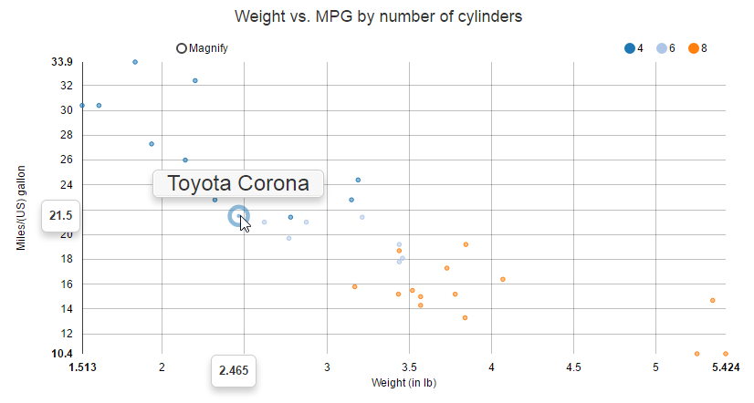
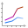
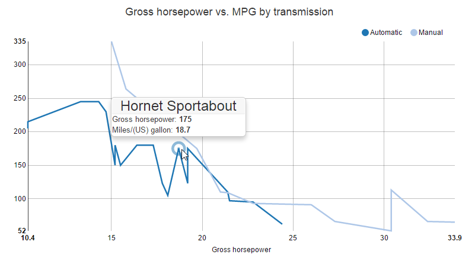
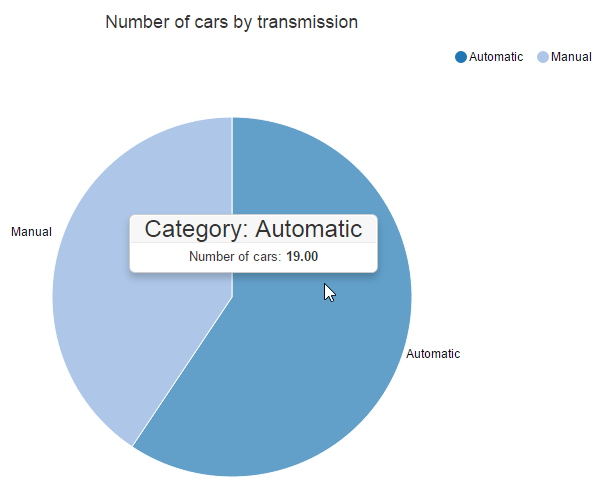

Motor Trend Car Road Tests Dataset Interactive Analysis
========================================================
author: VALAT Didier
date: 19/03/2016
autosize: true
transition: rotate
css: presentation.css

<medium>
Coursera Course Project - Developing Data Products
</medium>

Description
========================================================
incremental: true
type: prompt

<font size="6">
This presentation is based on **MT cars** data set which has been used to create an interactive shiny application.

The shiny application is available here: <https://dvalat.shinyapps.io/Developing_Data_Products_CP/>

The application is composed of:
- Navigation tabs 


which allow users to navigate between the analysis and information pages.
- A checkbox list of cars with select buttons
 in order to clear or select all the data set cars.
- But also, graphics and data tabs 


which are the "heart" of the application.
</font>

Analysis 1/3
========================================================
type: prompt

<font size="6">
For this analysis, I decided to produce 3 kinds of graphics (***move the mouse over the icons to display an overview of each***):
<ul class="enlarge">
<li><span>-------------------------------------------------------------</span>
</li>
this graph allow the user to compare the weight and milles per Gallon for each cylinders.
</ul>
<ul class="enlarge">
<li><span>-------------------------------------------------------------</span>
</li>
 this graph allow the user to compare the gross horsepower and milles per Gallon for each transmission type.
</ul>
<ul class="enlarge">
<li><span>-----------------------------------------------</span>
</li>
 this graph allow the user to compare the number of cars for each tranmission type.
</ul>
</font>

Analysis 2/3
========================================================
type: prompt

<font size="5">
I will now load some packages and initialize a Scatter chart object to make this presentation a little more interactive.


```r
# rCharts package loading, it needs to be isolated from other packages
library(rCharts)
```

```r
# Other package for data transformations
library(data.table)
# Load the dataset and ddd "brands" column to the data set
ds<-data.table(brands=rownames(mtcars),mtcars)
# Recode transmission variable
ds$am<-ifelse(ds$am==0,"Automatic","Manual")

# Create the Scatter chart
p3<-nPlot(mpg~wt, group='cyl', data=ds, type = "scatterChart")
p3$chart(tooltipContent = "#! function(key, x, y, e){
	return '<h3>' + e.point.brands + '</h3>'} !#")
p3$xAxis(axisLabel='Weight (in lb)')
p3$yAxis(axisLabel='Miles/(US) gallon')
```
</font>

Analysis 3/3
========================================================

<font size="4">The following graph is an extract from my shiny application. The aim was to include **rCharts** functionnalities into ```R Presenter``` .


```r
p3$show('iframesrc', cdn = TRUE) # Display the Scatter chart
```

<iframe srcdoc=' &lt;!doctype HTML&gt;
&lt;meta charset = &#039;utf-8&#039;&gt;
&lt;html&gt;
  &lt;head&gt;
    &lt;link rel=&#039;stylesheet&#039; href=&#039;http://nvd3.org/assets/css/nv.d3.css&#039;&gt;
    
    &lt;script src=&#039;http://ajax.googleapis.com/ajax/libs/jquery/1.8.2/jquery.min.js&#039; type=&#039;text/javascript&#039;&gt;&lt;/script&gt;
    &lt;script src=&#039;http://d3js.org/d3.v3.min.js&#039; type=&#039;text/javascript&#039;&gt;&lt;/script&gt;
    &lt;script src=&#039;http://timelyportfolio.github.io/rCharts_nvd3_tests/libraries/widgets/nvd3/js/nv.d3.min-new.js&#039; type=&#039;text/javascript&#039;&gt;&lt;/script&gt;
    &lt;script src=&#039;http://nvd3.org/assets/lib/fisheye.js&#039; type=&#039;text/javascript&#039;&gt;&lt;/script&gt;
    
    &lt;style&gt;
    .rChart {
      display: block;
      margin-left: auto; 
      margin-right: auto;
      width: 800px;
      height: 400px;
    }  
    &lt;/style&gt;
    
  &lt;/head&gt;
  &lt;body &gt;
    
    &lt;div id = &#039;chart5ff8265d508b&#039; class = &#039;rChart nvd3&#039;&gt;&lt;/div&gt;    
    &lt;script type=&#039;text/javascript&#039;&gt;
 $(document).ready(function(){
      drawchart5ff8265d508b()
    });
    function drawchart5ff8265d508b(){  
      var opts = {
 &quot;dom&quot;: &quot;chart5ff8265d508b&quot;,
&quot;width&quot;:    800,
&quot;height&quot;:    400,
&quot;x&quot;: &quot;wt&quot;,
&quot;y&quot;: &quot;mpg&quot;,
&quot;group&quot;: &quot;cyl&quot;,
&quot;type&quot;: &quot;scatterChart&quot;,
&quot;id&quot;: &quot;chart5ff8265d508b&quot; 
},
        data = [
 {
 &quot;brands&quot;: &quot;Mazda RX4&quot;,
&quot;mpg&quot;:             21,
&quot;cyl&quot;:              6,
&quot;disp&quot;:            160,
&quot;hp&quot;:            110,
&quot;drat&quot;:            3.9,
&quot;wt&quot;:           2.62,
&quot;qsec&quot;:          16.46,
&quot;vs&quot;:              0,
&quot;am&quot;: &quot;Manual&quot;,
&quot;gear&quot;:              4,
&quot;carb&quot;:              4 
},
{
 &quot;brands&quot;: &quot;Mazda RX4 Wag&quot;,
&quot;mpg&quot;:             21,
&quot;cyl&quot;:              6,
&quot;disp&quot;:            160,
&quot;hp&quot;:            110,
&quot;drat&quot;:            3.9,
&quot;wt&quot;:          2.875,
&quot;qsec&quot;:          17.02,
&quot;vs&quot;:              0,
&quot;am&quot;: &quot;Manual&quot;,
&quot;gear&quot;:              4,
&quot;carb&quot;:              4 
},
{
 &quot;brands&quot;: &quot;Datsun 710&quot;,
&quot;mpg&quot;:           22.8,
&quot;cyl&quot;:              4,
&quot;disp&quot;:            108,
&quot;hp&quot;:             93,
&quot;drat&quot;:           3.85,
&quot;wt&quot;:           2.32,
&quot;qsec&quot;:          18.61,
&quot;vs&quot;:              1,
&quot;am&quot;: &quot;Manual&quot;,
&quot;gear&quot;:              4,
&quot;carb&quot;:              1 
},
{
 &quot;brands&quot;: &quot;Hornet 4 Drive&quot;,
&quot;mpg&quot;:           21.4,
&quot;cyl&quot;:              6,
&quot;disp&quot;:            258,
&quot;hp&quot;:            110,
&quot;drat&quot;:           3.08,
&quot;wt&quot;:          3.215,
&quot;qsec&quot;:          19.44,
&quot;vs&quot;:              1,
&quot;am&quot;: &quot;Automatic&quot;,
&quot;gear&quot;:              3,
&quot;carb&quot;:              1 
},
{
 &quot;brands&quot;: &quot;Hornet Sportabout&quot;,
&quot;mpg&quot;:           18.7,
&quot;cyl&quot;:              8,
&quot;disp&quot;:            360,
&quot;hp&quot;:            175,
&quot;drat&quot;:           3.15,
&quot;wt&quot;:           3.44,
&quot;qsec&quot;:          17.02,
&quot;vs&quot;:              0,
&quot;am&quot;: &quot;Automatic&quot;,
&quot;gear&quot;:              3,
&quot;carb&quot;:              2 
},
{
 &quot;brands&quot;: &quot;Valiant&quot;,
&quot;mpg&quot;:           18.1,
&quot;cyl&quot;:              6,
&quot;disp&quot;:            225,
&quot;hp&quot;:            105,
&quot;drat&quot;:           2.76,
&quot;wt&quot;:           3.46,
&quot;qsec&quot;:          20.22,
&quot;vs&quot;:              1,
&quot;am&quot;: &quot;Automatic&quot;,
&quot;gear&quot;:              3,
&quot;carb&quot;:              1 
},
{
 &quot;brands&quot;: &quot;Duster 360&quot;,
&quot;mpg&quot;:           14.3,
&quot;cyl&quot;:              8,
&quot;disp&quot;:            360,
&quot;hp&quot;:            245,
&quot;drat&quot;:           3.21,
&quot;wt&quot;:           3.57,
&quot;qsec&quot;:          15.84,
&quot;vs&quot;:              0,
&quot;am&quot;: &quot;Automatic&quot;,
&quot;gear&quot;:              3,
&quot;carb&quot;:              4 
},
{
 &quot;brands&quot;: &quot;Merc 240D&quot;,
&quot;mpg&quot;:           24.4,
&quot;cyl&quot;:              4,
&quot;disp&quot;:          146.7,
&quot;hp&quot;:             62,
&quot;drat&quot;:           3.69,
&quot;wt&quot;:           3.19,
&quot;qsec&quot;:             20,
&quot;vs&quot;:              1,
&quot;am&quot;: &quot;Automatic&quot;,
&quot;gear&quot;:              4,
&quot;carb&quot;:              2 
},
{
 &quot;brands&quot;: &quot;Merc 230&quot;,
&quot;mpg&quot;:           22.8,
&quot;cyl&quot;:              4,
&quot;disp&quot;:          140.8,
&quot;hp&quot;:             95,
&quot;drat&quot;:           3.92,
&quot;wt&quot;:           3.15,
&quot;qsec&quot;:           22.9,
&quot;vs&quot;:              1,
&quot;am&quot;: &quot;Automatic&quot;,
&quot;gear&quot;:              4,
&quot;carb&quot;:              2 
},
{
 &quot;brands&quot;: &quot;Merc 280&quot;,
&quot;mpg&quot;:           19.2,
&quot;cyl&quot;:              6,
&quot;disp&quot;:          167.6,
&quot;hp&quot;:            123,
&quot;drat&quot;:           3.92,
&quot;wt&quot;:           3.44,
&quot;qsec&quot;:           18.3,
&quot;vs&quot;:              1,
&quot;am&quot;: &quot;Automatic&quot;,
&quot;gear&quot;:              4,
&quot;carb&quot;:              4 
},
{
 &quot;brands&quot;: &quot;Merc 280C&quot;,
&quot;mpg&quot;:           17.8,
&quot;cyl&quot;:              6,
&quot;disp&quot;:          167.6,
&quot;hp&quot;:            123,
&quot;drat&quot;:           3.92,
&quot;wt&quot;:           3.44,
&quot;qsec&quot;:           18.9,
&quot;vs&quot;:              1,
&quot;am&quot;: &quot;Automatic&quot;,
&quot;gear&quot;:              4,
&quot;carb&quot;:              4 
},
{
 &quot;brands&quot;: &quot;Merc 450SE&quot;,
&quot;mpg&quot;:           16.4,
&quot;cyl&quot;:              8,
&quot;disp&quot;:          275.8,
&quot;hp&quot;:            180,
&quot;drat&quot;:           3.07,
&quot;wt&quot;:           4.07,
&quot;qsec&quot;:           17.4,
&quot;vs&quot;:              0,
&quot;am&quot;: &quot;Automatic&quot;,
&quot;gear&quot;:              3,
&quot;carb&quot;:              3 
},
{
 &quot;brands&quot;: &quot;Merc 450SL&quot;,
&quot;mpg&quot;:           17.3,
&quot;cyl&quot;:              8,
&quot;disp&quot;:          275.8,
&quot;hp&quot;:            180,
&quot;drat&quot;:           3.07,
&quot;wt&quot;:           3.73,
&quot;qsec&quot;:           17.6,
&quot;vs&quot;:              0,
&quot;am&quot;: &quot;Automatic&quot;,
&quot;gear&quot;:              3,
&quot;carb&quot;:              3 
},
{
 &quot;brands&quot;: &quot;Merc 450SLC&quot;,
&quot;mpg&quot;:           15.2,
&quot;cyl&quot;:              8,
&quot;disp&quot;:          275.8,
&quot;hp&quot;:            180,
&quot;drat&quot;:           3.07,
&quot;wt&quot;:           3.78,
&quot;qsec&quot;:             18,
&quot;vs&quot;:              0,
&quot;am&quot;: &quot;Automatic&quot;,
&quot;gear&quot;:              3,
&quot;carb&quot;:              3 
},
{
 &quot;brands&quot;: &quot;Cadillac Fleetwood&quot;,
&quot;mpg&quot;:           10.4,
&quot;cyl&quot;:              8,
&quot;disp&quot;:            472,
&quot;hp&quot;:            205,
&quot;drat&quot;:           2.93,
&quot;wt&quot;:           5.25,
&quot;qsec&quot;:          17.98,
&quot;vs&quot;:              0,
&quot;am&quot;: &quot;Automatic&quot;,
&quot;gear&quot;:              3,
&quot;carb&quot;:              4 
},
{
 &quot;brands&quot;: &quot;Lincoln Continental&quot;,
&quot;mpg&quot;:           10.4,
&quot;cyl&quot;:              8,
&quot;disp&quot;:            460,
&quot;hp&quot;:            215,
&quot;drat&quot;:              3,
&quot;wt&quot;:          5.424,
&quot;qsec&quot;:          17.82,
&quot;vs&quot;:              0,
&quot;am&quot;: &quot;Automatic&quot;,
&quot;gear&quot;:              3,
&quot;carb&quot;:              4 
},
{
 &quot;brands&quot;: &quot;Chrysler Imperial&quot;,
&quot;mpg&quot;:           14.7,
&quot;cyl&quot;:              8,
&quot;disp&quot;:            440,
&quot;hp&quot;:            230,
&quot;drat&quot;:           3.23,
&quot;wt&quot;:          5.345,
&quot;qsec&quot;:          17.42,
&quot;vs&quot;:              0,
&quot;am&quot;: &quot;Automatic&quot;,
&quot;gear&quot;:              3,
&quot;carb&quot;:              4 
},
{
 &quot;brands&quot;: &quot;Fiat 128&quot;,
&quot;mpg&quot;:           32.4,
&quot;cyl&quot;:              4,
&quot;disp&quot;:           78.7,
&quot;hp&quot;:             66,
&quot;drat&quot;:           4.08,
&quot;wt&quot;:            2.2,
&quot;qsec&quot;:          19.47,
&quot;vs&quot;:              1,
&quot;am&quot;: &quot;Manual&quot;,
&quot;gear&quot;:              4,
&quot;carb&quot;:              1 
},
{
 &quot;brands&quot;: &quot;Honda Civic&quot;,
&quot;mpg&quot;:           30.4,
&quot;cyl&quot;:              4,
&quot;disp&quot;:           75.7,
&quot;hp&quot;:             52,
&quot;drat&quot;:           4.93,
&quot;wt&quot;:          1.615,
&quot;qsec&quot;:          18.52,
&quot;vs&quot;:              1,
&quot;am&quot;: &quot;Manual&quot;,
&quot;gear&quot;:              4,
&quot;carb&quot;:              2 
},
{
 &quot;brands&quot;: &quot;Toyota Corolla&quot;,
&quot;mpg&quot;:           33.9,
&quot;cyl&quot;:              4,
&quot;disp&quot;:           71.1,
&quot;hp&quot;:             65,
&quot;drat&quot;:           4.22,
&quot;wt&quot;:          1.835,
&quot;qsec&quot;:           19.9,
&quot;vs&quot;:              1,
&quot;am&quot;: &quot;Manual&quot;,
&quot;gear&quot;:              4,
&quot;carb&quot;:              1 
},
{
 &quot;brands&quot;: &quot;Toyota Corona&quot;,
&quot;mpg&quot;:           21.5,
&quot;cyl&quot;:              4,
&quot;disp&quot;:          120.1,
&quot;hp&quot;:             97,
&quot;drat&quot;:            3.7,
&quot;wt&quot;:          2.465,
&quot;qsec&quot;:          20.01,
&quot;vs&quot;:              1,
&quot;am&quot;: &quot;Automatic&quot;,
&quot;gear&quot;:              3,
&quot;carb&quot;:              1 
},
{
 &quot;brands&quot;: &quot;Dodge Challenger&quot;,
&quot;mpg&quot;:           15.5,
&quot;cyl&quot;:              8,
&quot;disp&quot;:            318,
&quot;hp&quot;:            150,
&quot;drat&quot;:           2.76,
&quot;wt&quot;:           3.52,
&quot;qsec&quot;:          16.87,
&quot;vs&quot;:              0,
&quot;am&quot;: &quot;Automatic&quot;,
&quot;gear&quot;:              3,
&quot;carb&quot;:              2 
},
{
 &quot;brands&quot;: &quot;AMC Javelin&quot;,
&quot;mpg&quot;:           15.2,
&quot;cyl&quot;:              8,
&quot;disp&quot;:            304,
&quot;hp&quot;:            150,
&quot;drat&quot;:           3.15,
&quot;wt&quot;:          3.435,
&quot;qsec&quot;:           17.3,
&quot;vs&quot;:              0,
&quot;am&quot;: &quot;Automatic&quot;,
&quot;gear&quot;:              3,
&quot;carb&quot;:              2 
},
{
 &quot;brands&quot;: &quot;Camaro Z28&quot;,
&quot;mpg&quot;:           13.3,
&quot;cyl&quot;:              8,
&quot;disp&quot;:            350,
&quot;hp&quot;:            245,
&quot;drat&quot;:           3.73,
&quot;wt&quot;:           3.84,
&quot;qsec&quot;:          15.41,
&quot;vs&quot;:              0,
&quot;am&quot;: &quot;Automatic&quot;,
&quot;gear&quot;:              3,
&quot;carb&quot;:              4 
},
{
 &quot;brands&quot;: &quot;Pontiac Firebird&quot;,
&quot;mpg&quot;:           19.2,
&quot;cyl&quot;:              8,
&quot;disp&quot;:            400,
&quot;hp&quot;:            175,
&quot;drat&quot;:           3.08,
&quot;wt&quot;:          3.845,
&quot;qsec&quot;:          17.05,
&quot;vs&quot;:              0,
&quot;am&quot;: &quot;Automatic&quot;,
&quot;gear&quot;:              3,
&quot;carb&quot;:              2 
},
{
 &quot;brands&quot;: &quot;Fiat X1-9&quot;,
&quot;mpg&quot;:           27.3,
&quot;cyl&quot;:              4,
&quot;disp&quot;:             79,
&quot;hp&quot;:             66,
&quot;drat&quot;:           4.08,
&quot;wt&quot;:          1.935,
&quot;qsec&quot;:           18.9,
&quot;vs&quot;:              1,
&quot;am&quot;: &quot;Manual&quot;,
&quot;gear&quot;:              4,
&quot;carb&quot;:              1 
},
{
 &quot;brands&quot;: &quot;Porsche 914-2&quot;,
&quot;mpg&quot;:             26,
&quot;cyl&quot;:              4,
&quot;disp&quot;:          120.3,
&quot;hp&quot;:             91,
&quot;drat&quot;:           4.43,
&quot;wt&quot;:           2.14,
&quot;qsec&quot;:           16.7,
&quot;vs&quot;:              0,
&quot;am&quot;: &quot;Manual&quot;,
&quot;gear&quot;:              5,
&quot;carb&quot;:              2 
},
{
 &quot;brands&quot;: &quot;Lotus Europa&quot;,
&quot;mpg&quot;:           30.4,
&quot;cyl&quot;:              4,
&quot;disp&quot;:           95.1,
&quot;hp&quot;:            113,
&quot;drat&quot;:           3.77,
&quot;wt&quot;:          1.513,
&quot;qsec&quot;:           16.9,
&quot;vs&quot;:              1,
&quot;am&quot;: &quot;Manual&quot;,
&quot;gear&quot;:              5,
&quot;carb&quot;:              2 
},
{
 &quot;brands&quot;: &quot;Ford Pantera L&quot;,
&quot;mpg&quot;:           15.8,
&quot;cyl&quot;:              8,
&quot;disp&quot;:            351,
&quot;hp&quot;:            264,
&quot;drat&quot;:           4.22,
&quot;wt&quot;:           3.17,
&quot;qsec&quot;:           14.5,
&quot;vs&quot;:              0,
&quot;am&quot;: &quot;Manual&quot;,
&quot;gear&quot;:              5,
&quot;carb&quot;:              4 
},
{
 &quot;brands&quot;: &quot;Ferrari Dino&quot;,
&quot;mpg&quot;:           19.7,
&quot;cyl&quot;:              6,
&quot;disp&quot;:            145,
&quot;hp&quot;:            175,
&quot;drat&quot;:           3.62,
&quot;wt&quot;:           2.77,
&quot;qsec&quot;:           15.5,
&quot;vs&quot;:              0,
&quot;am&quot;: &quot;Manual&quot;,
&quot;gear&quot;:              5,
&quot;carb&quot;:              6 
},
{
 &quot;brands&quot;: &quot;Maserati Bora&quot;,
&quot;mpg&quot;:             15,
&quot;cyl&quot;:              8,
&quot;disp&quot;:            301,
&quot;hp&quot;:            335,
&quot;drat&quot;:           3.54,
&quot;wt&quot;:           3.57,
&quot;qsec&quot;:           14.6,
&quot;vs&quot;:              0,
&quot;am&quot;: &quot;Manual&quot;,
&quot;gear&quot;:              5,
&quot;carb&quot;:              8 
},
{
 &quot;brands&quot;: &quot;Volvo 142E&quot;,
&quot;mpg&quot;:           21.4,
&quot;cyl&quot;:              4,
&quot;disp&quot;:            121,
&quot;hp&quot;:            109,
&quot;drat&quot;:           4.11,
&quot;wt&quot;:           2.78,
&quot;qsec&quot;:           18.6,
&quot;vs&quot;:              1,
&quot;am&quot;: &quot;Manual&quot;,
&quot;gear&quot;:              4,
&quot;carb&quot;:              2 
} 
]
  
      if(!(opts.type===&quot;pieChart&quot; || opts.type===&quot;sparklinePlus&quot; || opts.type===&quot;bulletChart&quot;)) {
        var data = d3.nest()
          .key(function(d){
            //return opts.group === undefined ? &#039;main&#039; : d[opts.group]
            //instead of main would think a better default is opts.x
            return opts.group === undefined ? opts.y : d[opts.group];
          })
          .entries(data);
      }
      
      if (opts.disabled != undefined){
        data.map(function(d, i){
          d.disabled = opts.disabled[i]
        })
      }
      
      nv.addGraph(function() {
        var chart = nv.models[opts.type]()
          .width(opts.width)
          .height(opts.height)
          
        if (opts.type != &quot;bulletChart&quot;){
          chart
            .x(function(d) { return d[opts.x] })
            .y(function(d) { return d[opts.y] })
        }
          
         
        chart
  .tooltipContent( function(key, x, y, e){
	return &#039;&lt;h3&gt;&#039; + e.point.brands + &#039;&lt;/h3&gt;&#039;} )
          
        chart.xAxis
  .axisLabel(&quot;Weight (in lb)&quot;)

        
        
        chart.yAxis
  .axisLabel(&quot;Miles/(US) gallon&quot;)
      
       d3.select(&quot;#&quot; + opts.id)
        .append(&#039;svg&#039;)
        .datum(data)
        .transition().duration(500)
        .call(chart);

       nv.utils.windowResize(chart.update);
       return chart;
      });
    };
&lt;/script&gt;
    
    &lt;script&gt;&lt;/script&gt;    
  &lt;/body&gt;
&lt;/html&gt; ' scrolling='no' frameBorder='0' seamless class='rChart  nvd3  ' id='iframe-chart5ff8265d508b'> </iframe>
 <style>iframe.rChart{ width: 100%; height: 400px;}</style>

<div align="center">Thank you for reading this presentation and I hope you will enjoy <a href="https://dvalat.shinyapps.io/Developing_Data_Products_CP/">my application</a>!</div>
<div align="center">If you want to keep in touch with me:</div>
<div align="center"><a href="https://twitter.com/big_data_flow" alt="Big Data Flow"></a>&nbsp;&nbsp;&nbsp;
<a href="https://fr.linkedin.com/in/didiervalat" alt="LinkedIn Didier VALAT"></a></div>
</font>
